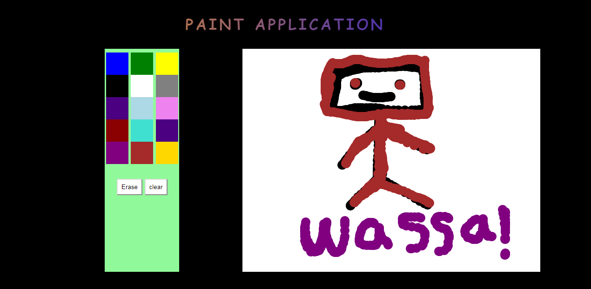

# Paint app without the use of canvas !

Well, it's not the best and it is very simple. But, it is good for putting your html, css, and JavaScript Skills under practice. 

## You can simply draw what you want

### Note:

When you try to move the mouse faster, you will notice that you are drawing dots and not lines, this is because the event listener for mousemove event is kinda slow i think. I might be thinking for a solution for that later.  